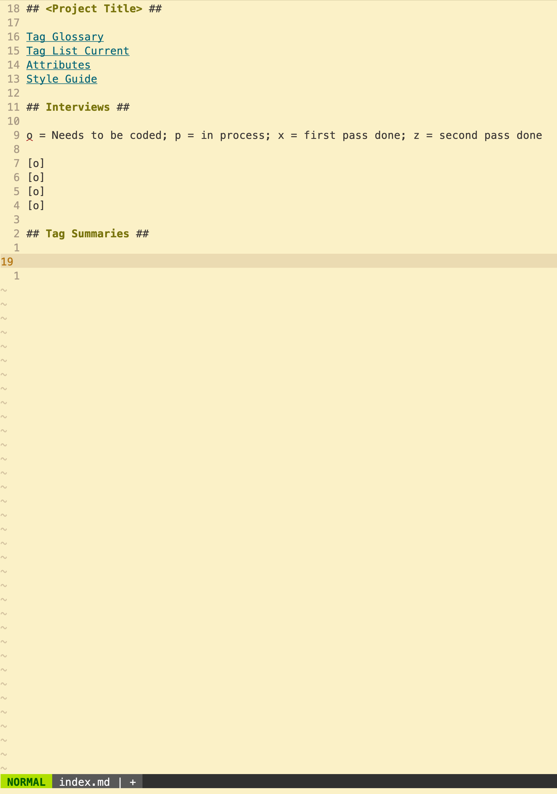
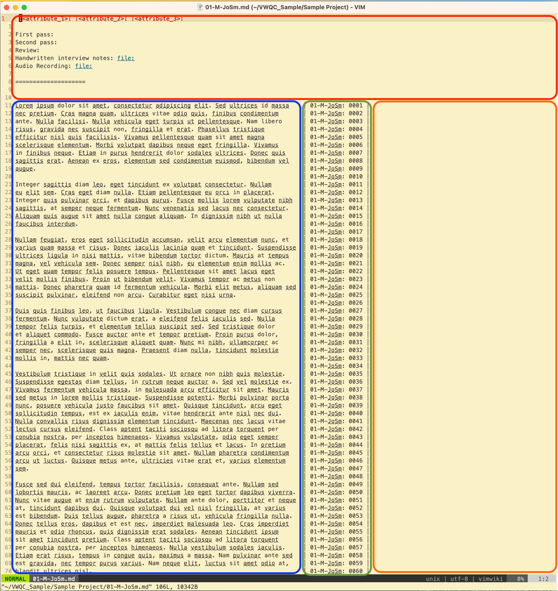
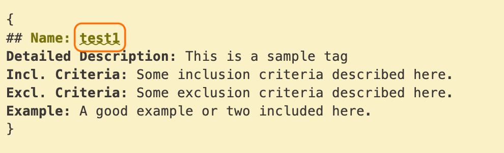
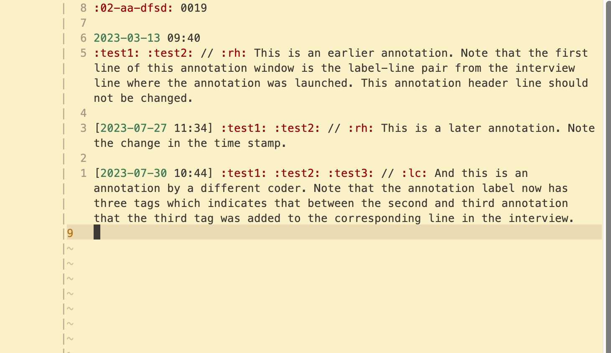
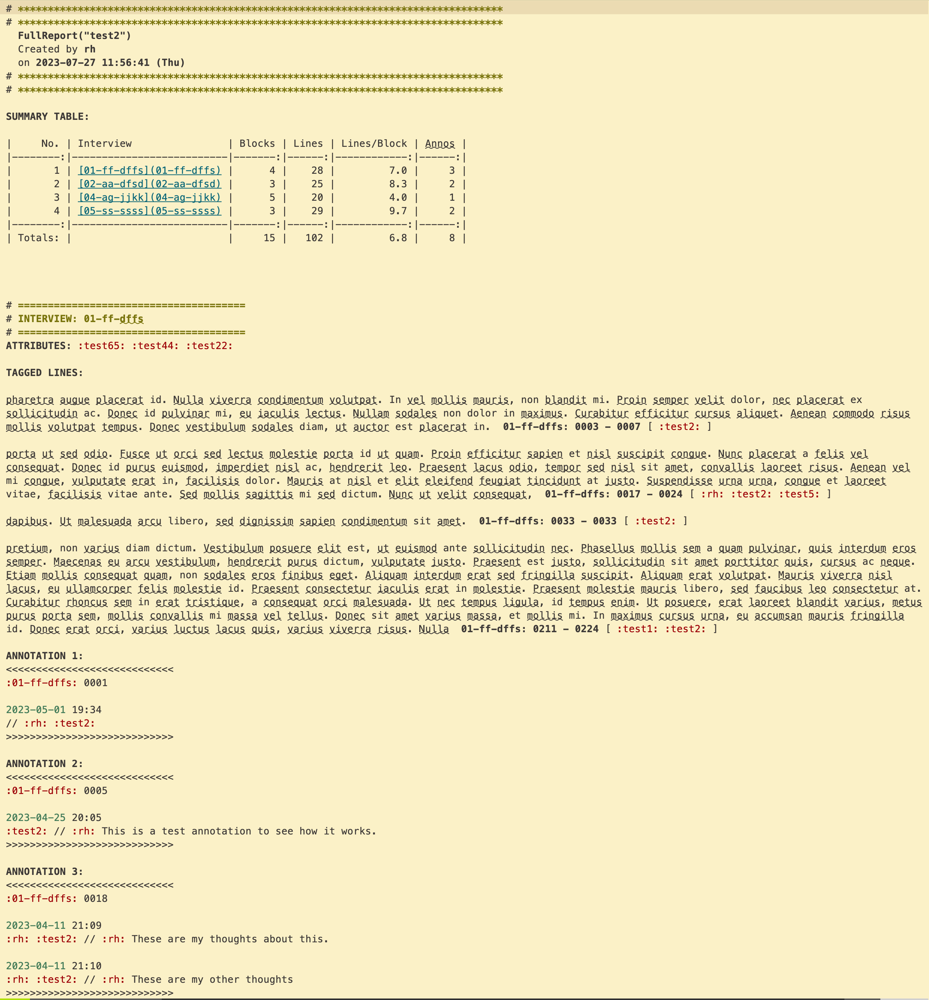
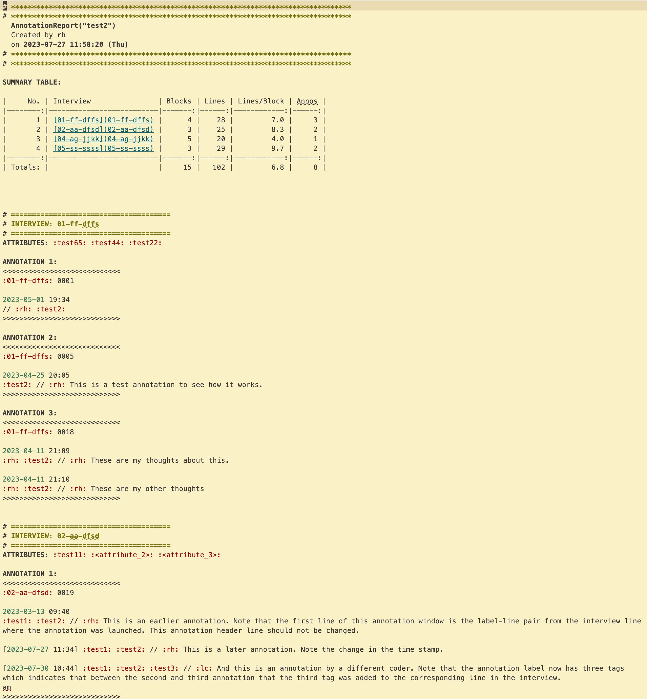
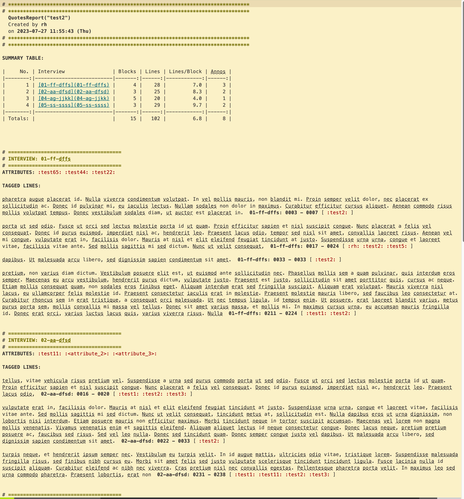
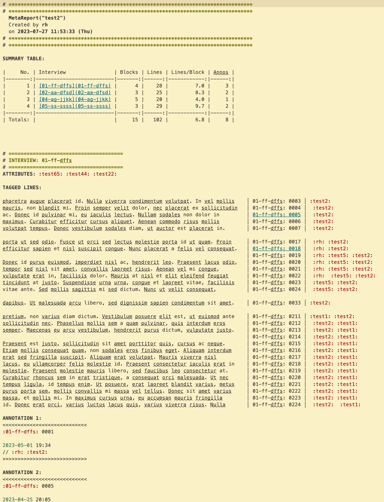

```
__     ___                   _ _    _ 
\ \   / (_)_ __ _____      _(_) | _(_)
 \ \ / /| | '_ ` _ \ \ /\ / / | |/ / |
  \ V / | | | | | | \ V  V /| |   <| |
   \_/  |_|_| |_| |_|\_/\_/ |_|_|\_\_|
                                      
  ___              _ _ _        _   _              ____          _      
 / _ \ _   _  __ _| (_) |_ __ _| |_(_)_   _____   / ___|___   __| | ___ 
| | | | | | |/ _` | | | __/ _` | __| \ \ / / _ \ | |   / _ \ / _` |/ _ \
| |_| | |_| | (_| | | | || (_| | |_| |\ V /  __/ | |__| (_) | (_| |  __/
 \__\_\\__,_|\__,_|_|_|\__\__,_|\__|_| \_/ \___|  \____\___/ \__,_|\___|
```

# Vimwiki Qualitative Code (VWQC)

- [Intro](#introduction)
- [Installation](#installation)
    - [Prerequisites](#prerequisites)
    - [VIM Packages](#vim-packages)
    - [Vim-Plug](#vim-plug)
- [Key Bindings and Commands](#key-bindings-and-commands)
- [Project Setup](#project-setup)
- [Formatting Interviews](#formatting-interviews)
- [Navigation](#navigation)
- [Coding or Tagging](#coding-or-tagging)
- [Annotating](#annotating)
- [Reports](#reports)
- [Ag and Rg Searching](ag-and-rg-searching)
- [Backup](#backup)
- [Getting Help](#getting-help)
- [Development and Bugs](#development-and-bugs)
- [License](#vwqc-license)


## Introduction ##

Vimwiki Qualitative Code (VWQC), a fork of Vimwiki, is a linewise qualitative coding plugin for working with text. VWQC allows you to code, annotate and generate reports for interviews. It adds functionality to VIM and Vimwiki. See https://github.com/vimwiki/vimwiki for documentation on Vimwiki.

Linewise means the basic coding units are lines of text rather that exact text blocks selected with a mouse. By default, lines are formatted to 80 characters which in practice will usually correspond to about one sentence. Each qualitative coding project is a Vimwiki wiki with some additional key-value pairs added to the Vimwiki configuration dictionary.

VWQC uses popup windows which are best displayed in a GUI implementation of Vim or Neovim.

**The development branch for vwqc is vim9.**

## Installation ##

### Prerequisites ###

VWQC requires **Vim 9.1 or higher**. Although Vimwiki, which VWQC is built on, is written in legacy Vimscript, VWQC is written in Vim9script. VWQC cannot be run in Neovim because Neovim does not support Vim9script.

Make sure you have the following settings in your .vimrc file:

```
set nocompatible
filetype plugin on
syntax on
```

The following packages are used by VWQC: git and ripgrep. 

- `git` facilitates the installation of Vim plugins. 
- `ripgrep` is used for searching projects.

For Debian and Debian-based Linux distributions these packages can be installed with the following command:

```
$ sudo apt install git ripgrep
```
On Linux systems with `snapd` installed `ripgrep` can alternatively be installed with:

```
sudo snap install ripgrep --classic
```

For MacOS these packages can be installed with the following command:

(Note if you haven't installed brew yet you can find instructions at https://docs.brew.sh/Installation.)

```
$ brew install git ripgrep
```

### VIM Packages ###

### Vim-Plug ###

VWQC and fzf are Vim plugins. There are several good plugin managers. This documentation assumes you're useing VimPlug (https://github.com/junegunn/vim-plug). Use the documentation at the link provided to install vim-plug. At the beginning of your .vimrc (or your init.vim if you're using NeoVim) you should have the following:

```
" ---------------- Plugins ------------------
 
call plug#begin('~/.vim/plugged')
 
Plug 'junegunn/fzf', {'do': { -> fzf#install() } }
Plug 'junegunn/fzf.vim'
Plug 'Rick-Hiemstra/vwqc.vim', { 'branch': 'vim9' }
 
call plug#end()
```

You may also have additional plugins installed.

## Key Bindings and Commands ##

The following keybindings and commands are set in the plugin.  

**NAVIGATION**
- `<leader>gt`                          Go to
- `<leader>gb`                          Go back 
- `<F7>`                                Annotation Toggle

**CODING**
- `<F2>`                               Update tags
- `<F8>`                               Omni-complete (tags and files), same as `<F9>`
- `<F9>`                               Omni-complete (tags and files), same as `<F8>`
- `<F5>`                               Complete tag block
- `<F4>`                               Toggle tag block completion mode
- `<leader>tf`                         Tag fill
- `<leader>da`                         Delete annotation
- `<leader>df`                         Get/define tag definition
- `<leader>tc`                         Double-colon omni-complete toggle

**REPORTS**
- `:call FullReport("<tag>")`           Create full tag summary
- `:call AnnotationsReport("<tag>")`    Create tag annotations summary
- `:call QuotesReport("<tag>")`         Create tag report for coded interview lines
- `:call Gather("<tag>")`               Create secondary tag sub-report
- `:call AllSummariesFull()`              Create FullReport summaries for all tags in tag glossary 
- `:call AllSummariesQuotes()`            Create QuotesReport summaries for all tags in tag glossary 
- `:call AllSummariesAnnos()`             Create AnnnotationsReport summaries for all interviews and all tags in tag glossary 
- `:call TagStats()`                      Create tables and graphs by tag and interview 
  
**WORKING WITH REPORTS**
- `<leader>th`                          Trim head
- `<leader>tt`                          Trim tail
- `<leader>ta`                          Trim head and tail 

**APPARATUS**
- `:call ProjectSetup()`                Launches project initialization dialogue
- `:call Attributes(<sort col number>)` Create attribute table and sort by column number
- `:call SortTagDefs()`                 Sort tag definition list inside Tag Glossary page
- `:call FormatInterview()`             Format interview page
- `<leader>rs`                          Resize windows
- `<leader>bk`                          Create project backup
- `<leader>hm`                          Help menu
- `<leader>ph`                          Page help
- `<leader>lp`                          List project parameters

See also vwqc/plugin/vwqc_keybindings.vim in the plugin directory

## Project Setup ##

### Project Configuration ###

VWQC is built on Vimwiki and each project is its own Vimwiki. Each project will have its own Vimwiki configuration in your .vimrc or your init.vim. The block below is shows how you would configure two projects (Project 1 and Project 2). These project configurations define vimscript dictionaries that Vimwiki and VWQC use to define your project.

```
" ------------------------ Project 1 Configuration ------------------------
let wiki_1 = {}
let wiki_1.path = '~/Project 1/Project 1 wiki/'
let wiki_1.auto_tags = 0
let wiki_1.syntax = 'markdown'
let wiki_1.ext = '.md'
let wiki_1.vwqc = 1
let wiki_1.name = 'Project one name'
let wiki_1.interview_label_regex = '\d\d-\w\w-\w\w\w\w'
let wiki_1.text_col_width = 80
let wiki_1.coder_initials = 'rh'

" ------------------------ Project 2 Configuration ------------------------
let wiki_2 = {}
let wiki_2.path = '~/Project 2/Project 2 wiki/'
let wiki_2.auto_tags = 0
let wiki_2.syntax = 'markdown'
let wiki_2.ext = '.md'
let wiki_2.vwqc = 1
let wiki_2.name = 'Project two name'
let wiki_2.interview_label_regex = '\d\d-\w\w-\w\w\w\w'
let wiki_2.text_col_width = 80
let wiki_2.coder_initials = 'rh'

" ------------- List of your projects in the order you'll reference them -----------
let g:vimwiki_list = [wiki_1, wiki_2]
```

Note: The following Vimwiki specific configurations have been set in vwqc/plugin/vwqc_keybindings.vim. Override them in your `.vimrc` if you would prefer different behavior.

```
let g:vimwiki_global_ext = 0
let g:vimwiki_url_maxsave = 0
let g:vimwiki_auto_update_tags = 0
```

Here are what each configuration line does:

- `{}`: This defines an empty project vimscript dictionary.
- `path`: The path to this project's Vimwiki. Note that it is enclosed in single quotes and that it ends with a `/`.
- `auto_tags`: This tells VWQC not to automatically update its tag list for this project. 
- `syntax`: This tells VWQC the file type we're going to use. Markdown is currently the only file time that has been tested to work.
- `ext`: Defines the file type extension
- `vwqc`: Indicates that this is a VWQC project. Because VWQC is a fork of Vimwiki, projects without this item will be treated as a normal Vimwiki wiki.
- `interview_label_regex`: Defines a regular expression for our interview labels. There will be more on this below.
- `text_col_width`: Defines the character width of the interview text pane.
- `coder_initials`: The initials for the coder. This is most useful if more than one person is working on a project but it still needs to be set. In this case, it has been set to 'rh' which are the initials of one of this plugin's maintainers.
- `name`: This is the name label for the project. The `ProjectSetup()` function uses this configuration item to name project subdirectories.

#### The `interview_label_regex` wiki configuration entry ####

VWQC uses regular expressions to find interview labels. An interview label may include abbreviated elements such as the interview number, the gender of the interviewee, something about their expertise, and a pseudonym. 

`01-M-JoSm`

You will define your own codes for your project and track them in a style guide.

The elements would represent the following:

- `01` - The interview number. In this case, the first interview. Note that the number has been padded with a leading zero.
- `M` - The gender. In this case, **M** for male.
- `JoSm` - An abbreviation for John Smith. There are different ways to identify your informants. Using the first two letters of the first and last names has the advantage of creating a consistent label element length of 4.
  
We recommend you use a simple combination of `\d` (for digits, or numbers) and `\w` (for characters) to define your `interview_label_regex`. 

A regular expression that would find the example above would be:

```
'\d\d-\w-\w\w\w\w'
```

(Two digits followed by a dash, followed by one character, followed by a dash, followed by four characters.)

Note your regular expression in your project configuration must be inside single quotes, not double quotes.

In practice, your labels will be a combination of digits, dashes and word characters. This should give you the building blocs you need to create your interview labels. In practice you wouldn't want these labels to be longer than about 12 characters. They should be descriptive enough so that coders can identify the interviewee without being so descriptive that you might inadvertently compromise the confidentiality of your interviewees should someone happened to oversee your coding.

Regular expressions are a systematic way to search text. There are lots of online resources explaining how they work. This website is particularly helpful for writing and testing regular expressions: https://regex101.com/. Keep in mind that there are different implementations of regular expressions for different programming languages and different applications. Vim's scripting language is called Vimscript or VimL and it has its own regex idiosyncrasies. You can learn more about how Vim handles regular expressions by using the help Vim help function. In normal mode in Vim type:

```
:h regex
```

**Note**: The following Vimwiki specific configurations have been set in vwqc/plugin/vwqc_keybindings.vim. Override them in your `.vimrc` if you would prefer different behavior.

```
let g:vimwiki_global_ext = 0
let g:vimwiki_url_maxsave = 0
let g:vimwiki_auto_update_tags = 0
```

### Initializing Your Project ###

After your project has been configured in your `.vimrc`, launch VIM, and navigate to your project wiki. For example, to navigate to **wiki_2** press `2<leader>ww`. This will take you to the *index* page for your wiki. 

At first you will be greeted with a popup window telling you that no VWQC wiki tags have been populated this session. Click on this window to close it and ignore it for the time being. At this point you will not have any tags to update.

Each project has its own set of *tags* or *codes* (terms that will be used interchangeably in this documentation). These need to be populated at the start of each session and when new tags are added. Click on the popup window to close it.

In normal mode, type `:call ProjectSetup()` and follow the dialog. The dialog will tell you about different folders being set up for you. You can get a list of these folders after the dialog finishes by pressing `<leader>lp` (mnemonic: List Parameters). When the dialog is finished you should be presented with a page like this:



**Notes:** This is a suggested layout for your project landing, or index page. Highlighted text indicates text that is linked. There are many ways to navigate to links but the simplest is to press tab in normal mode to cycle through the links on the page. The first three links to administrative pages:

- Tag Glossary
- Tag List Current
- Attributes

are necessary for your project. 

The second section titled "Interviews" are where we suggest you sequentially link to your interview files (more on this in the [Formatting Interviews](#formatting-interviews) section below).

The last section titled "Tag Summaries" is where we suggest you link to your summary files, which is the terminology we use for reports (more on this in the [Reports](#reports) section below)

Take note of the information in the popup windows presented to you. This dialogue information can be viewed later by typing `<leader>lp` in normal mode.

#### Creating the Interview Header Template ####

A default interview header template is created for you by the `ProjectSetup()` function. You can see where it is by typing `<leader>lp` in normal mode. The interview header template is added to the top of all interview files and it has two parts. 

1. **The attribute tag line** is the first line of all interview files. Attributes are interview attributes usually corresponding to the interview subject. Example attributes might be gender, province, or sociological generation. These are attributes which you may want to use to 'cut' or 'segment' your analysis by. The following is the default header template:

```
 :<attribute_1>: :<attribute_2>: :<attribute_3>:

First pass:  
Second pass: 
Review: 
Handwritten interview notes: [[file:]]
Audio Recording: [[file:]]

====================

```

Tags in Vimwiki, and by extension VWQC, are delimited by colons containing contiguous characters. The `<attribute_x>` in angle brackets are merely placeholder text. Prior to formatting interviews these should be edited to reflect the attributes you'll want to do your analysis on. For example, you may change the default header to:

```
 :gender: :province: :generation:

First pass:  
Second pass: 
Review: 
Handwritten interview notes: [[file:]]
Audio Recording: [[file:]]

====================

```

Your custom header will be populated to all your interview pages when they are formatted (see below). In the interview pages themselves, the *gender* tag, for example, would be replaced with the subject's gender, for example, :female:.

Note that attribute tags, and all tags, need to be separated by a space. This includes a space preceding the first attribute tag on the attribute tag line. 

The remaining lines in the interview header template are administrative suggestions. The `[[file:]]` notation allows you to link to other files. We'll return to this in the Formatting Interviews section below.

## Formatting Interviews ##

Interview pages are linked to from your project landing page (or index) page. To create a link to the page and go there enter the name of your interview page that corresponds to your interview label regular expression (regex) that you defined in your project configuration. If you've forgotten your regex you can see it by typing `<leader>lp` in normal mode.


Interview text should be copied and pasted into the empty interview buffer. 

Interviews are formatted with the `:call FormatInterview()`. 

The formatted interview pages has four panes or sections:

1) The header pane (outlined in red)
2) The interview pane (outlined in blue)
3) The label-line pane (outlined in green)
4) The coding pane (outlined in orange)



### The Interview Header ###

The interview header is populated from the interview header template and is an administrative area. If, for example, our template was:

```
 :gender: :province: :generation:

First pass:  
Second pass: 
Review: 
Handwritten interview notes: [[file:]]
Audio Recording: [[file:]]

====================

```

We might modify it as follows:

```
 :female: :Ontario: :Millennial:

First pass: Jack
Second pass: Jill
Review: 
Handwritten interview notes: [[file:~/Sample Project/notes/01-M-JoSm.pdf]]
Audio Recording: [[file:~/Sample Project/audio/01-M-JoSm.mp3]]

====================

```

**Note**: The tags on the attribute line must be separated by a space, and their must be a space preceding the first tag on the attribute tag line. 

### The Interview Pane ###

The interview pane appears on the left-hand side of the window underneath the interview header. This interview pane will be as wide as you specified in your project configuration. After formatting, the interview pane content should not be changed.

### The Label-Line Pane ##

The label-line pane appears to the right of the interview pane bordered by two vertical lines. One each line appears a label line pair. The label corresponds to the interview label for the page and the line corresponds to the line number within the interview pane. These label-line pairs are used to generate links to annotation pages and to facilitate navigation around your project. Although the syntax for links will be added to the label-line pairs as you annotate your project, these line-label pairs themselves should not be edited or changed.

### The Coding Pane ###

The coding pane appears to the right of the label-line pain and this is where you will add tags, or codes, as well as other short notions. Coding and annotating will be covered in sections below.

## Navigation ##

Vim, as an editor, has its own customizable navigation keyboard shortcuts. Graphical implementations of Vim may support mouse navigation as well. To learn basic Vim navigation we recommend:

1. vimtutor
2. Neil, Drew, *Practical Vim Second Edition: Edit Text at the Speed of Thought,* Pragmatic Bookshelf, 2015.

### Basic Vimwiki Navigation ###

VWQC is a fork of Vimwiki and retains all of its navigation properties. These are the basics of Vimwiki navigation:

- **Tab**: In normal mode, the tab key jumps sequentially through the links on a page.
- **Backspace**: In normal mode, the backspace key goes back to the previous page.
- **Enter**: In normal mode, when your cursor is on a link, pressing enter will follow the link.

### VWQC-Specific Navigation ###

When you are on a line with a label-line pair pressing `<leader>gt` (mnemonic: Go To) will take you to that label-line pare in the corresponding interview. Pressing `<leader>gb` (mnemonic: Go Back) will take you back to the last place from which you pressed `<leader>gt`.

## Coding or Tagging ##

#### Why line-wise coding? ####

Most commercial qualitative coding software will have the user highlight blocks of text with a mouse which are then coded. VWQC codes lines of text. This allows us to use the built-in line editing functionality of Vim. A consequence of line-wise coding is that portions of the top and bottom of a code block may be unintentionally coded. VWQC has tools to trim the *head* and *tail* where extraneous text is coded (see "Trimming Quotes" section below). 

#### Adding new codes or tags ####

Tags (codes) are contiguous words beginning with a letter and surrounded by colons.  For example `:family:` or `:child:`. Each line can have multiple tags. Tags should be separated by a space. The best way to add a new code to VWQC, including its definition, is as follows:

1. Type the code into the coding pane on the first line of a block of text you want to assign this code. 
2. Place your cursor on the newly added code.
3. In normal mode, type `<leader>df` (mnemonic: DeFine) and follow the dialogue.

This dialogue will present you with a tag definition template in the `Tag Glossary` page (or buffer). A tag definition is delimited by a top line with a `{` and a bottom line with a `}`. The presenting template is our suggestion. Everything between the delimiting brace brackets can be chance with one exception. The tag name has to be the last word on the first line following the opening brace bracket line (see figure below)



After you've finished defining your tag, you need to update the project tag list by pressing `<F2>`. After updating the project tag list you can return to where you were coding by typing `<leader>gb` (mnemonic: Go Back). 

Now, if you place your cursor over this newly defined tag (which has been added to the project tag list by pressing `<F2>`) and type `<leader>df` (mnemonic: DeFine), instead of starting the tag definition dialogue, you should see a popup window with your tag's definition. This window can be closed by moving your cursor off the tag.

Note: The "Tag List Current" page, which can be navigated to from your project home, or index, page, will list your project's current tags. The "Tag List Current" page is automatically populated or updated each time you press `<F2>`.

#### Coding ####

Usually, interviews will be coded from the beginning (or top of your buffer) to the end (or the bottom of the buffer). For this reason, VWQC assumes that you'll tag the top of your code block before the bottom. VWQC has code (or tag) omni-completion that can be launched by pressing the `<F8>` key after typing a partial code or tag (Note: `<F9>` is also mapped to tag omni-completion). For example, suppose your code was `:Boomer:`. If you started typing `:B` and then pressed `<F8>` a popup menu would appear at your cursor listing all the current tags, or codes, beginning with `B`. You can then use either the j or k keys to move through the popup menu items to select your code or keep typing to reduce the options in the list before making your selection. After you've made your selection do not forget to complete the tag, or code, with the delimiting closing colon.

Now that you've added the top code for your code block, you can fill the code the code block by moving your cursor to the bottom line of the block of text you want to code. From the bottom of the code block you need to tell VWQC which code to fill. Pressing `<F5>` will present you with a list of tags. This list is populated with the codes appearing in the contiguous code block above the cursor plus the last code added to the buffer. The default code appearing in the menu will either be the last code added to the buffer or the first code found above your cursor. This behaviour can be toggled using the `<F4>` key and the `<F5>` popup window title will tell you which default code behaviour is being used. 

If a line has more than one code, VWQC will vertically align like codes.

You may wish to code a block of text with more than one code (or tag). Repeat the steps above for the new coding block by typing the new code block's top, delimiting code, to the end of the line where you want to add the new code.


## Annotating ##

Annotations are your thoughts about some text. Annotations can be added to a code block, for example, by placing your cursor anywhere on the first (top) line of a code block and pressing `<F7>` to open an annotation window on the left-hand side of your screen. `<F7>` is the annotation window toggle: It will both open and close an annotation window. When an annotation window is opened it will automatically be named using the label-line pair from the interview line your cursor was on when you pressed `<F7>`. Additionally, your annotation will be labelled with the tags that were on the interview line when you pressed `<F7>`, a time stamp, and your coder initials which you included in your project configuration. It is common for a coder to either make several coding passes, or for different members of a team to make coding passes. VWQC's automatic labelling will let you know who made which annotations and when. When a pre-existing annotation window is re-opened using `<F7>` a new annotation is appended to the annotation page with its own label set.



## Reports ##

There are several kinds of reports or summaries produced by VWQC:

- Full Reports `call FullReport()`
- Annotation Reports `:call AnnotationsReport()`
- Quotes Reports `:call QuotesReport()`
- Meta Reports `:call MetaReport()`
- VWS Reports `:call VWSReport()`

In addition to there is the secondary grouping function `Gather` that creates reports of secondary coding within the "Quotes" report.

All reports have their own file or buffer and every report buffer name must begin with the word "Summary". For example, a full report for "tag2" might be named "Summary full tag2", but it cannot be named "tag2 report" or "Full tag2" because those names do not begin with "Summary".



### Full Reports ###

#### Individual Full Reports ###

The full report is a report of all the interview material for a tag including corresponding annotations. A full report can be generated for an individual tag as follows:

1. On the *index* or landing page for your project prepare a link name called "Summary Full tag2".
2. Visually select the tag name, and press enter twice to create and navigate to the page.
3. On the new, empty page, or buffer, in normal mode type: ` :call FullReport("tag2")` and press <ENTER>

#### Batch Full Reports ####

Alternatively, full reports for all the tags defined in the *Tag Glossary* can be generated as a batch as follows:

1. Place your cursor at the bottom of the *Tag Summaries* section of your project index page.
2. In normal mode, type: `:call AllSummariesFull()` and press <ENTER>

### Annotation Reports ###

Annotations reports only include the annotation material from the full report. Annotation reports are generated analogously to full reports as follows:

1. On the *index* or landing page for your project prepare a link name called "Summary anno tag2".
2. Visually select the tag name, and press enter twice to create and navigate to the page.
3. On the new, empty page, or buffer, in normal mode type: ` :call AnnotationsReport("tag2")` and press <ENTER>



### Quotes Reports ###

#### Individual Quote Reports ####

Quote reports only include the *quote* material from the full report. Quote reports are generated analogously to full reports as follows:

1. On the *index* or landing page for your project prepare a link name called "Summary quotes tag2".
2. Visually select the tag name, and press enter twice to create and navigate to the page.
3. On the new, empty page, or buffer, in normal mode type: ` :call QuotesReport("tag2")` and press <ENTER>



#### Batch Quote Reports ####

Alternatively, quotes reports for all the tags defined in the *Tag Glossary* can be generated as a batch as follows:

1. Place your cursor at the bottom of the *Tag Summaries* section of your project index page.
2. In normal mode, type: `:call AllSummariesQuotes()` and press <ENTER>

#### Secondary Coding - The Gather() Function ####

Within a quote report, the quotes themselves can be tagged a second time by adding tags to the end of each quote. Alternatively, because the quotes in the quotes report include all the tags from each quoted block, the `Gather()` function can be used as and *AND* operator. For example, if a quote report had been generated for tag1. Suppose you wanted to find every quote block that was tagged with tag1 and tag2. Within the quote report for tag1 you would do the following:

1. Place your cursor just under the statistical table that appears at the top of the quote report and above the quoted material.
2. In normal mode, type `:call Gather("tag2")` and press <ENTER>

A sub report with all the quote blocks that were coded for both tag1 and tag2 will appear at your cursor. This can be repeated for other tags by positioning your cursor just above the original quote-report, quote-block material and running another Gather() function replacing "tag2" for the next tag of interest. Note that the Gather() function looks for material below the cursor which is why the cursor needs to positioned above the quoted material before the Gather() function is run.

### Meta Reports ###

Meta reports include all the material from the full report except the *quotes* material is presented as if it were directly excerpted from the project interview files. Meta reports are generated analogously to full reports as follows:

1. On the *index* or landing page for your project prepare a link name called "Summary meta tag2".
2. Visually select the tag name, and press enter twice to create and navigate to the page.
3. On the new, empty page, or buffer, in normal mode type: ` :call MetaReport("tag2")` and press <ENTER>



### VWS Reports ###

VWS Reports have the same format as full reports, but, unlike full reports, the search term does not need to be a tag.

`VWSReport()` is a wrapper for Vimwiki's `VimwikiSearch` (`VWS`) which is itself a wrapper for `lvimgrep`. `VWSReport()` creates the same report as the `TagReport()` but instead of using a tag as the search term it suses other non-tag search terms.

```
:call VWSReport("<search terms>")
```

In `lvimgrep` you can make a search case insensitive by prefixing the search term with `\c`. When using `VWSReport()`, however, you need to prefix your search terms with `\\c`. For example to create a case insensitive report on all the instances of the word Bible in your wiki you would run the following command:

```
:call VWSReport("\\cBible")
```
This will find instances of "Bible", "bible", "biBle", etc.

You can also create a report that combines more than one search term. For example to create a report of all instances of Facebook, Instagram and Pinterest you would run the following:

```
:call VWSReport("Facebook\\|Instagram\\|Pinterest")
```
As with other report functions, the results in the report will be presented in interview file name alphabetical order.

### CSV Output ###

In addition to producing summary reports within your project VWQC also produces corresponding CSV output for each report in a "tag summaries" directory. The "tag summaries" directory can be seen by typing `<leader>lp` in normal mode.

CSV file records have the following fields:

1. Tag name record records
2. Interview label
3. Block number within interview
4. Line text
5. Line number within interview
6. Number of lines in interview
7. A set of interview attribute tags

### Trimming Quotes ###

A consequence of line-wise coding is that portions of the top and bottom of a code block may be unintentionally coded. We assume that the reports will be used to copy and paste text from Vim into a word processor like Microsoft Word and that you may want to remove partial leading and/or trailing sentences that were unintentionally code. VWQC gives you three keybindings to do this.

- `<leader>tt` (mnemonic: Trim Tail)
- `<leader>th` (mnemonic: Trim Head)
- `<leader>ta` (mnemonic: Trim All) - a combination of `<leader>tt` and `<leader>th`.


## Ag and Rg Searching ##

VWQC has to similar search functions the "Silver Searcher" and Ripgrep. When each of these utilities are launched an ["ncurses"](https://en.wikipedia.org/wiki/Ncurses#:~:text=ncurses%20(new%20curses)%20is%20a,in%20a%20terminal%2Dindependent%20manner.) search window is launched.

(It is recommended that you change make sure you're in your project directory by pressing `<leader>cd` in normal mode prior to launching Ag or Rg because they will search recursively within the systems present working directory (pwd).)

To launch the Silver Searcher, in normal mode, type `:Ag` and press <Enter>. 

To launch the Ripgrep, in normal mode, type `:Rg` and press <Enter>. 

## Getting Help ##

From anywhere in your project you can see a general help menu by pressing `<leader>hm` (mnemonic: Help Menu) in normal mode. In addition, most pages have page-specific help menus that can be accessed by pressing `<leader>ph` (mnemonic: Page Help).

### How to learn VIM ###

1. vimtutor
2. Neil, Drew, *Practical Vim Second Edition: Edit Text at the Speed of Thought,* Pragmatic Bookshelf, 2015.

## Backup ##

Projects can be easily backed up by pressing `<leader>bk` (mnemonic: BacKup) in normal mode. This creates a time-stamped directory with a copy of your project files in the project backup directory. You can see where the project backup directory is by pressing `<leader>lp` (mnemonic: List Parameters)

VWQC doesn't have a restore function, however, a project can be restored by copying the contents of a backup directory to the project directory overwriting the corrupted files in the project directory.

## Development and Bugs ##

Here are planned improvements:

1. Improve documentation
2. A set of YouTube instructional videos
3. Change tag ommi-complete behavior so that non-VWQC Vimwiki wikis have the default Vimwiki tag omni-completion behaviour.
4. Fix bug after adding the first tag in a session, the tag fill function fails if the tag is below a tag block. This can be worked around by filling another tag, and undoing it. After that everything works as expected.
5. Tags aren't re-aligned if code is filled within a tag block. This is doesn't affect how VWQC works. Its just not as easy to read as aligned codes. To fix this we'll have to look below the cursor as well as above in order to define the code block in view.

## VWQC License ##

MIT License

Copyright (c) 
- 2023-2023 Rick Hiemstra   
- 2023-2023 Lindsay Callaway

Permission is hereby granted, free of charge, to any person obtaining a copy
of this software and associated documentation files (the "Software"), to deal
in the Software without restriction, including without limitation the rights
to use, copy, modify, merge, publish, distribute, sublicense, and/or sell
copies of the Software, and to permit persons to whom the Software is
furnished to do so, subject to the following conditions:

The above copyright notice and this permission notice shall be included in all
copies or substantial portions of the Software.

THE SOFTWARE IS PROVIDED "AS IS", WITHOUT WARRANTY OF ANY KIND, EXPRESS OR
IMPLIED, INCLUDING BUT NOT LIMITED TO THE WARRANTIES OF MERCHANTABILITY,
FITNESS FOR A PARTICULAR PURPOSE AND NONINFRINGEMENT. IN NO EVENT SHALL THE
AUTHORS OR COPYRIGHT HOLDERS BE LIABLE FOR ANY CLAIM, DAMAGES OR OTHER
LIABILITY, WHETHER IN AN ACTION OF CONTRACT, TORT OR OTHERWISE, ARISING FROM,
OUT OF OR IN CONNECTION WITH THE SOFTWARE OR THE USE OR OTHER DEALINGS IN THE
SOFTWARE.

